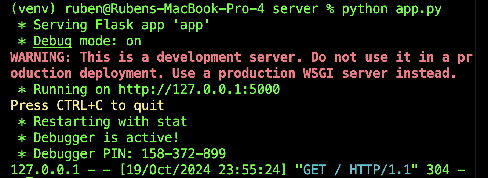

# Muscle-Mind: Fitness Quiz and Challenge Game

**Muscle-Mind** is an interactive quiz game designed to test players’ knowledge of fitness, health, and nutrition while keeping them physically engaged. Players are challenged with a variety of timed questions, and incorrect answers lead to physical exercise penalties such as push-ups or squats, making it both an educational and physically engaging experience.

## Project Concept
The primary goal of **Muscle-Mind** is to promote fitness and learning in a fun and interactive way. The game focuses on creating a healthy balance between mental and physical challenges, ensuring players not only learn more about health topics but also incorporate physical activity into the experience.

## Key Features
- **Create Custom Quizzes**: Registered users can create their own quizzes, making the platform highly customizable.
- **Exercise Penalties**: Wrong answers result in a random exercise challenge, such as performing 15 squats, 10 push-ups, or a short jumping jack session.
- **Grade Reports**: Players can receive a grade report of their score for each quiz.

## How to Play
1. Players begin by logging in to access their custom quizzes.
2. Each question presents a set of multiple-choice questions.
3. Incorrect answers trigger a randomized exercise penalty.
4. After the game, players receive a performance report.

## Technology Stack
- **Frontend**
  - HTML/CSS
- **Backend**
  - Flask (Python)
- **Database**
  - MySQL

## Contributions
This project is developed as part of the Software Construction **CS 4374 course**. The game’s initial focus is on creating a robust fitness quiz platform that integrates both mental and physical challenges for a unique learning experience.

# How to setup on your machine

## 1. Download VSCode
There are many tutorials out there and I am sure most of you have it.
## 2. Setup Git and GitHub
If you don't have a GitHub account it's okay, make one and get it working with VSCode. You can install it by clicking the source control icon on the left side and there will be an option for installing it.

Once you have it installed, click the clone repository button, then click clone from GitHub, then allow, then sign in with your username and password, and click continue. Give it all permission or always allows (this will make it smoother). Once you are signed in, click on clone repository once again, and paste `https://github.com/riddle-me-ruben/muscle-mind.git`, it will ask you where you want to save it. Open the folder using VSCode and you should now see the files!

You won't be able to make changes on GitHub if I didn't get your GitHub username. Put it in the excel sheet or just msg me so I can add you.

## 3. Install python (if you haven't) and create a virtual enviornment
Check to see if you have python by running `python --version` in the terminal in VSCode. If you don't, install it and get it working with VSCode. If you are on mac try `python3 --version`. Only proceed once you have it installed.

If you do have python, we are going to create what is called a "virtual enviornment" which is basically a fake terminal that you use whenever you need to install a bunch of libraries. This way, these libraries won't be installed on your system and if you mess something up then it won't affect it. 

Create the virtual enviornment by entering in vscode `Ctrl + Shift + P` (Windows) or `CMD + Shift + P`, then in the search menu search for `Python: Select Interpreter`. Click the create virtual enviornment and install the `requirements.txt`. 

If you are on windows, make sure you select new COMMAND PROMPT in vscode and NOT powershell and make sure you have `(.venv)` before your terminal name. If you want to get out of the enviornment (deactivate) enter `deactivate` into the terminal. You should see the `venv` go away but if it doesn't change the python interpreter using the instructions above. 

If you are on mac, open a new terminal and run `source venv/bin/activate` to activate virtual environment (MAKE SURE IT SAYS venv ON LEFT SIDE OF TERMINAL in VSCode).

Run `pip list` and make sure you have everything installed.

## 4. Running the program
Put the `.env` file I sent you on teams in the `server/` folder. This has the username and password to access the database. Don't give it out and it's okay to leave in the folder because it is ignored by git.

Using the terminal in vscode, navigate to the server folder `cd src/server/` and enter `python app.py`

You should see this kind of output:

Open Google Chrome and enter `127.0.0.1:5000` 

If you need to quit enter `Ctrl + C` in terminal.

## 5. Accessing the shared database
Go to `https://www.phpmyadmin.co/` and sign in using the username and password I sent in the .env file. The server name is `sql5.freesqldatabase.com`

You might need to solve a CAPTCHA. After solving that and signing in, click the little plus icon next to the database username in the top left hand corner.

# Before Making Changes
* Before making any changes run `git pull origin main`