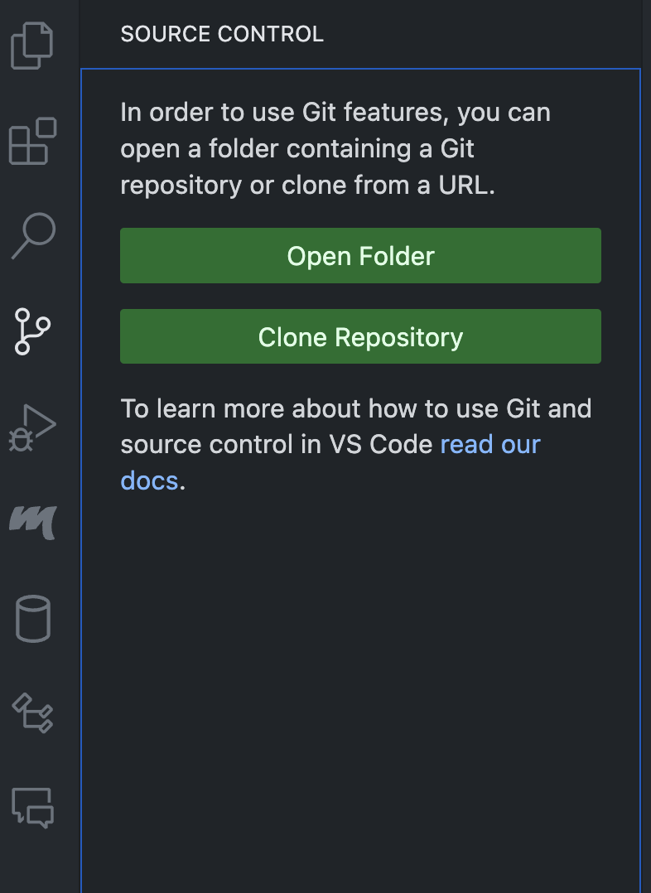

# How to setup on your machine

## 1. Download VSCode
There are many tutorials out there and I am sure most of you have it.
## 2. Setup Git and GitHub
If you don't have a GitHub account it's okay, make one and get it working with VSCode. You can install it by clicking the source control icon on the left side and there will be an option for installing it.

Once you have it installed, click the clone repository button, then click clone from GitHub, then allow, then sign in with your username and password, and click continue. Give it all permission or always allows (this will make it smoother). Once you are signed in, click on clone repository once again, and paste `https://github.com/riddle-me-ruben/muscle-mind.git`, it will a`sk you where you want to save it. Open the folder using VSCode and you should now see the files!

You won't be able to make changes on GitHub if I didn't get your GitHub username. Put it in the excel sheet or just msg me so I can add you.

## 3. Install python (if you haven't) and create a virtual enviornment
Check to see if you have python by running `python --version` in the terminal in VSCode. If you don't, install it and get it working with VSCode.

If you do have python, we are going to create what is called a "virtual enviornment" which is basically a fake terminal that you use whenever you need to install a bunch of libraries. This way, these libraries won't be installed on your system and if you mess something up then it won't affect it. 

Create the virtual enviornment by running `Ctrl + Shift + P` (Windows) or `CMD + Shift + P`, then in the search menu search for Python: Select Interpreter. Click the create virtual enviornment and install the requirements.txt. 

If you are on windows, make sure you select new COMMAND PROMPT in vscode and NOT powershell and make sure you have `(.venv)` before your terminal name. If you want to deactivate type `deactivate`

If you are on mac, open a new terminal and run `source venv/bin/activate` to activate virtual environment (make sure it says venv on left side of terminal in VSCode).

Run `pip list` and make sure you have everything installed.

## 4. Running the program
Put the `.env` file I sent you on teams in the `server/` folder. This has the username and password to access the database. Don't give it out and it's okay to leave in the folder because it is ignored by git.

In the terminal or command prompt, navigate to the server folder, and enter `python app.py`.